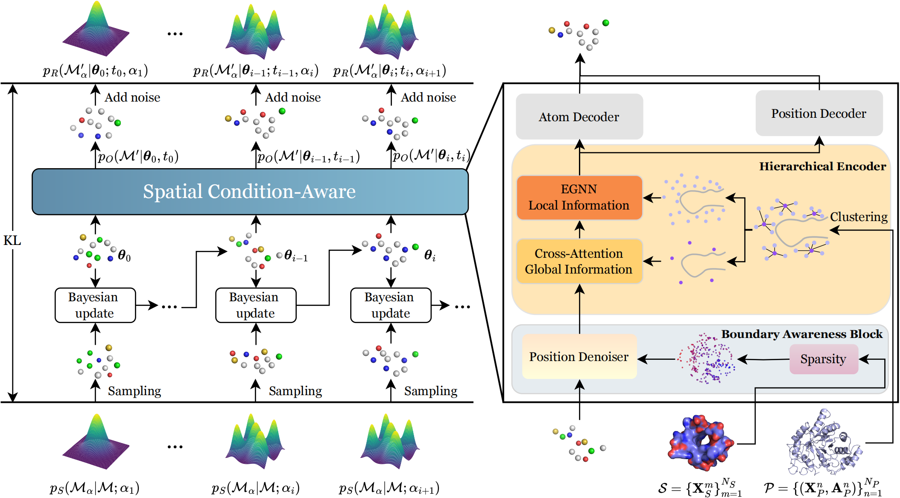
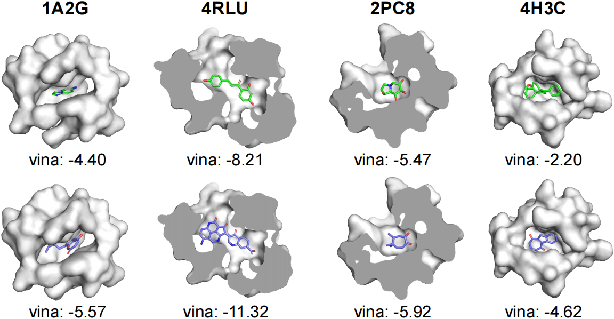

# SculDrug: A Spatial Condition-Aware Bayesian Flow Model for Structure-based Drug Design
## Overview
SculDrug is a novel spatial condition-aware generative model designed for structure-based drug design (SBDD). It leverages Bayesian Flow Networks (BFNs) to generate high-affinity drug ligands while addressing key challenges in drug discovery: boundary condition constraints, hierarchical structural integration, and spatial modeling fidelity. By employing a progressive denoising strategy, incorporating protein surface information, and using a hierarchical encoder, SculDrug ensures the generation of ligands with improved geometric compatibility, stability, and structural integrity.

## Framework Diagram


## SculDrug
### Clone the Repository
git clone https://anonymous.4open.science/r/PSRP-1D6E/
### Install Dependencies
Ensure you have the required dependencies installed. You can install them using the following:
| Python            |3.9.17     |
| PyTorch           |2.1.0+cu118|
| PyTorch Geometric |2.3.1      |
| RDKit             |2023.9.5   |
### Data
1. Download crossdocker dataset
2. Extraction of protein accessibility surface points

The data set will be made public after the results are published
### Train on CrossDocked:
To train the model, use the following command:
```
python ./train_bfn.py --config_file configs/default.yaml --exp_name train_model --revision 0 --devices 0
```
### generation
To generate Ligands using an official checkpoint, use the following command:
```
python train_bfn.py --test_only --num_samples 100 --sample_steps 100 --ckpt_path ./checkpoints/checkpoint.ckpt
```
./ligands_result/generated.pt
The generation results can be visualized as follows:


## Acknowledgement
This project draws in part from [TargetDiff](https://github.com/guanjq/targetdiff) [MolCraft](https://github.com/AlgoMole/MolCRAFT) and [CBGbench](https://github.com/EDAPINENUT/CBGBench), supported by MIT License  CC BY-NC-SA 4.0 and GPL-3.0 license. Thanks for their great work and code!